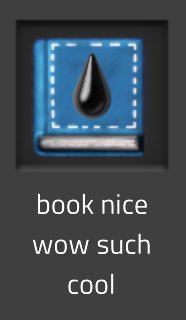
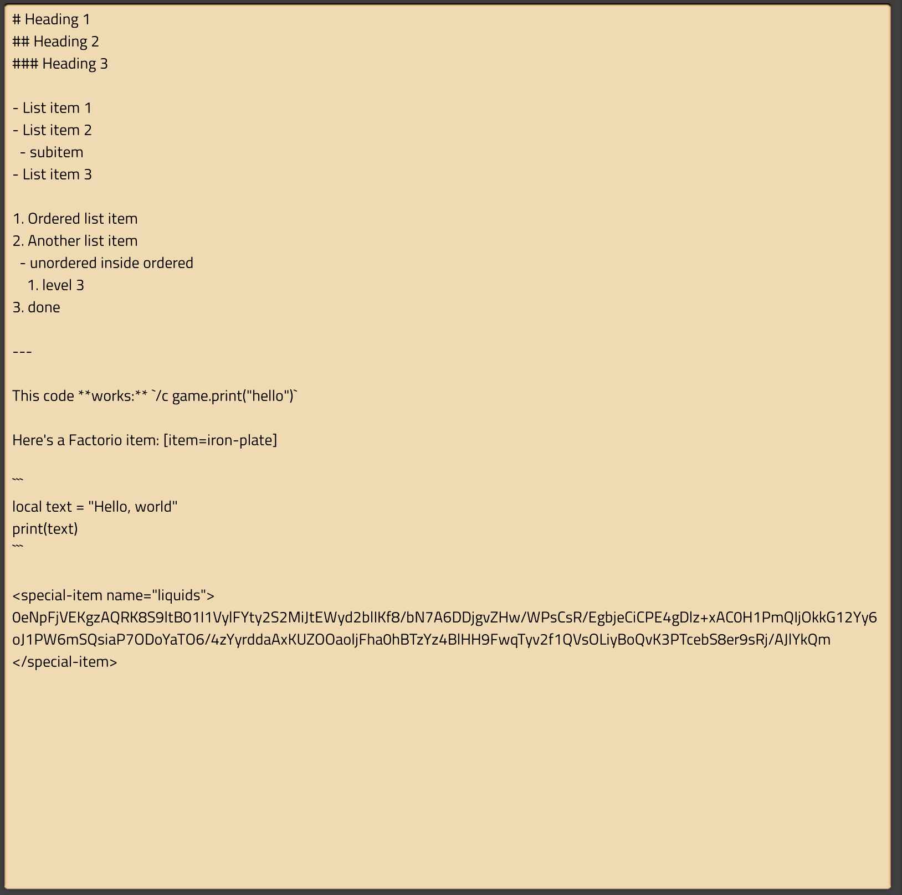
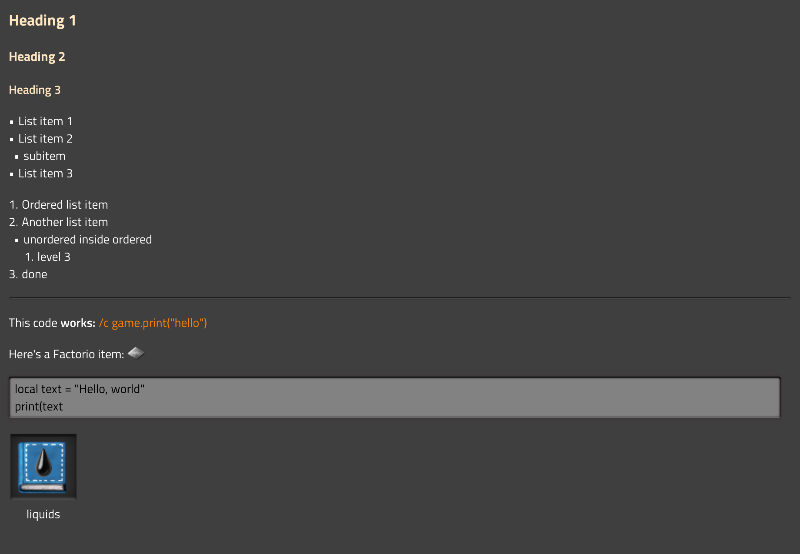

# Factorio knowledge base


## What is it?

This is a Factorio mod that provides a wiki-like system for documenting your Factorio world.

## Features

- **Rich text formatting**\
  Provides a Markdown-like syntax for formatting your text neatly.\
  Supports Factorio's built-in rich text.\
  [Formatting documentation](#formatting) or [formatting example](#formatting-example)
- **Multiplayer-friendly**\
  The mod is built for multiplayer with data consistency and UPS-friendliness in mind, though [some issues](https://github.com/the418-gg/factorio-knowledge-base/issues) might crop up.

A lot more is planned for future releases. You can take a look [here](https://github.com/the418-gg/factorio-knowledge-base/issues) to get a gist of what's being worked on.

## Formatting

> Suggestions on how to improve this documentation are welcome!

### Basics

At the core of Knowledge Base lies a Markdown-like formatting system. Supported syntax includes:

- Headings:\
  `# First-level heading`\
  `## Second-level heading`\
  `### Third-level heading`
- Bold text: `**this will be bold**`
- Lists:
  - Unordered lists:\
    `- List item 1`\
    `- List item 2`
  - Ordered lists:\
    `1. List item 1`\
    `2. List item 2`
- Horizontal rule: `---`
- Inline code: (surround your text in backticks ("`"))
- Code blocks: (surround lines of text in three backticks)

### Custom content

Knowledge Base aims to provide special syntax to include Factorio-specific data into your text. Currently, though, only blueprints are implemented.

#### Blueprints

To insert a clickable blueprint, blueprint book, deconstruction planner or upgrade planner, use the following XML-like syntax:

```xml
<special-item>
[blueprint string]
</special-item>
```

Example:

```xml
<special-item>
0eNpFjVEKgzAQRK8S9ltB01I1VylFYty2S2MiJtEWyd2blIKf8/bN7A6DDjgvZHw/WPsCsR/EgbjeCiCPE4gDlz+xAC0H1PmQIjOkkG12Yy6oJ1PW6mSQsiaP7ODoYaTO6/4zYyrddaAxKUZOOaoljFha0hBTzYz4BlHH9FwqTyv2f1QVsOLiyBoQvK3PTcebS8er9sRj/AJlYkQm
</special-item>
```



This blueprint slot is clickable and will insert the blueprint into your cursor when you click on it.

You can provide a `name` attribute to override the blueprint's name in your text:

```xml
<special-item name="cringe book">
[blueprint string]
</special-item>
```

## Formatting example

### Raw text



### Result



## Installation

[Download on the Mod Portal.](https://mods.factorio.com/mod/the418_kb)

## Contributing

### Running tests

```sh
cd markup
luarocks install --only-deps factoriomark-0.1.0-1.rockspec
busted tests/test.lua
```
